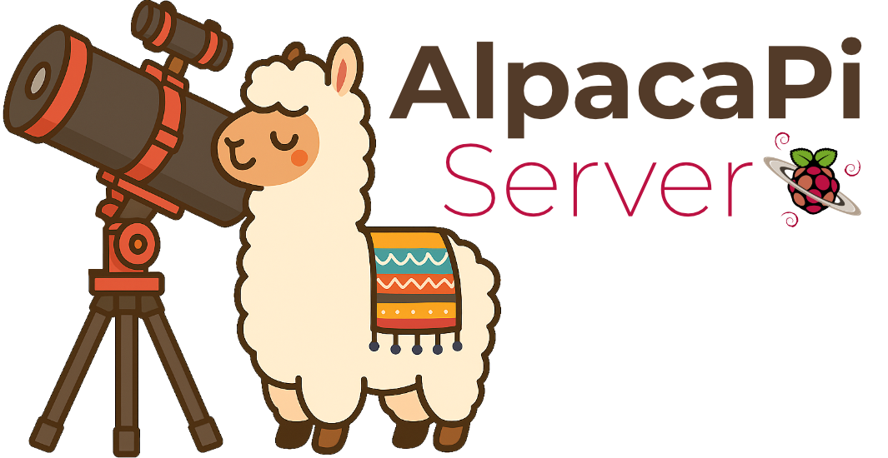

## **AlpacaPi Server**

AlpacaPi Server is built on the device agnostic ASCOM Alpaca protocol, which uses standard HTTP/REST and JSON for communication. This means any Alpaca-compatible application can control your astrophotography gear without platform lock-in or driver-installation headaches.

Once AlpacaPi Server is running, your devices can be controlled through popular software such as N.I.N.A. (Nighttime Imaging ’N’ Astronomy), Sequence Generator Pro (SGPro), SkySafari 7, Voyager, and many other Alpaca aware applications all without installing ASCOM or hardware specific drivers on your computer.

The goal of AlpacaPi Server is to provide astrophotographers with a clean, lightweight operating system image for Raspberry Pi devices. Instead of dumping every possible driver onto the system. AlpacaPi Server installs only the drivers you actually need based on the gear you select. As your setup evolves, you can simply rerun the script to add, remove, or update drivers with zero clutter.

## Wiki Documenation
All documation for AlpacaPi Server is listed in the [Wiki](https://github.com/open-astro/AlpacaPi-Server/wiki)

## 🏆 Credits
The AlpacaPi Server project acknowledges and appreciates the contributions of the following:

Mark Sproul — Creator of [AlpacaPi](https://github.com/msproul/AlpacaPi)

Special recognition is given to Mark Sproul, the original creator of AlpacaPi.
His vision, engineering expertise, and long-standing commitment to the Alpaca standard have made AlpacaPi one of the most important open-source foundations in modern astrophotography.
The reliability, structure, and flexibility of this project are built directly on the work he pioneered.

AI-Assisted Development

Development has been supported by modern AI tools, including ChatGPT and Cursor, which assisted with refactoring, documentation, and code generation throughout the project.

Open-Source Community

Appreciation is extended to the broader open-source astrophotography community for advancing Alpaca standards, sharing knowledge, and promoting interoperability across devices and platforms.
